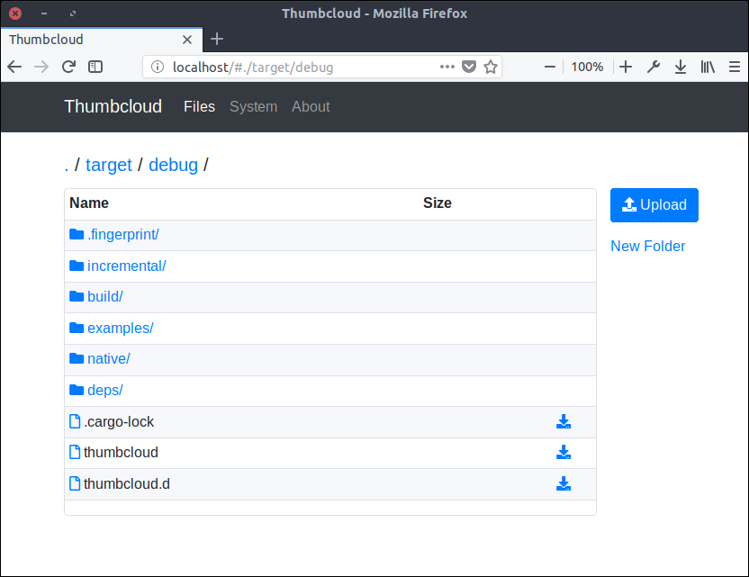

# Thumbcloud
Thumbcloud is a file-sharing server to replace your USB thumbdrive


## Idea and State
Sharing files via a USB thumbdrive is not optimal:
* only one user can access the content at a time
* you have to carry a physical object (which you will for sure forget when you need it the most, thanks to [Murphy's law](https://en.wikipedia.org/wiki/Murphy%27s_law))
* USB connections are "slow"
* not all modern computers have USB type A ports
* USB drives are limited in size (often just a few GB)

Thumbcloud is my attempt to create an application to share files with friends and collegues, on the 
same network. Moreover, they don't need to install any additional software (all they need is a 
webbrowser).

__Disclaimer__: The software is still in early development and misses some features. Furthermore,
there are few bugs and maybe even security flaws. In a nutshell, you shouldn't use the software on
an untrusted network nor with sensitive data, but feel free to try it out.

## Install
Just download the [latest release](https://github.com/flofriday/thumbcloud/releases) and unpack it.

Warning: Windows and macOS might warn you because the binaries are not singed.
Feel to free ignore those warnings.

### Build from source
1. [Install rust](https://doc.rust-lang.org/book/second-edition/ch01-01-installation.html)
2. [Download the repository](https://github.com/flofriday/thumbcloud/archive/master.zip)
3. Unzip the compressed file and run `cargo build --release`
4. Run the executable<br> 
   Windows PowerShell: `.\target\release\thumbcloud.exe $HOME --open`<br>
   Windows CMD: `.\target\release\thumbcloud.exe %HOMEPATH% --open`<br>
   Unix (macOS, Linux, FreeBSD): `./target/release/thumbcloud $HOME --open`

## Usage
1. Open a terminal in the directory with the executable
2. Windows CMD: `.\thumbcloud.exe %HOMEPATH% --open`<br>
   Windows PowerShell: `.\thumbcloud.exe $HOME --open`<br>
   Unix (macOS, Linux FreeBSD): `./thumbcloud $HOME --open`

```
USAGE:
    thumbcloud [FLAGS] [OPTIONS] <INPUT>

FLAGS:
    -h, --help            Prints help information
        --open            Opens thumbcloud in the default webbrowser
        --simple-icons    Gives all files the same icons (improves performance)
    -V, --version         Prints version information

OPTIONS:
    -a, --addr <address>    Sets the IP address and port the server will launch
    -n, --name <name>       Sets a custom servername

ARGS:
    <INPUT>    Sets the path thumbcloud will share

```

## Contributing
Check out [CONTRIBUTING.md)](CONTRIBUTING.md) for more information.

## Feature List / TODO
### v0.0.1
- [X] Viewing files in the webbrowser

### v0.0.2
- [X] Download files from the webbrowser
- [X] "fancy" aka useable Web UI
- [X] Show filesize
- [X] About page
- [X] Let the user selecte the shared folder
- [X] Parse commandline arguments

### v0.0.3
- [X] Upload files
- [X] Automatic local IP detection
- [X] File icons dependent on filetype
- [X] Template engine for HTML files
- [X] System page
- [X] 404 page

### v0.0.4
- [X] Use clippy to improve code quality
- [ ] Add detailed documentation
- [X] Add contribution guidelines

### v0.1.0
- [ ] Optimize for mobile devices
- [ ] GUI for server
- [ ] Add Logo
- [ ] Product Website

### after v0.1.0
- [ ] Download folders as .zip
- [ ] View file content without downloading
- [ ] File Operations
    - [ ] Drag & Drop
    - [ ] Copy Paste
    - [ ] Move
    - [ ] Delete
    - [ ] Find files
- [ ] Server Settings
    - [ ] Set max connections
    - [ ] Restrict to only download, only view files
    - [ ] Only access with password (basic auth)
